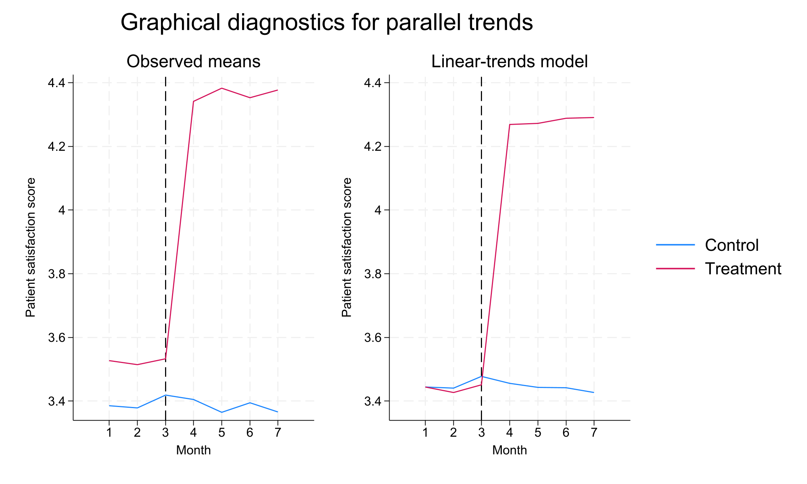

# Stata Local MCP

[한국어](README.md) | **English**

Run local Stata analyses from Codex or Claude Desktop through a standard MCP stdio server. This is a public preview, tested on Windows with Python 3.12 and StataNow 19.5 BE. Other operating systems and Stata editions have not been verified.

## Install on Windows

1. Download `stata-mcp-0.1.5-windows-setup.zip` from the [v0.1.5 release](https://github.com/seokjinwoo/stata-mcp/releases/tag/v0.1.5). No GitHub login is required.
2. Extract the entire ZIP, then double-click **install.cmd** (`설치.cmd` works too).
3. Choose **1. 한국어 / 2. English**. Press **2** for English.
4. Choose **Codex**, **Claude Desktop**, or **Both** when asked.
5. Select your Stata installation if needed. Setup checks a real Stata regression and graph before registering the selected apps.
6. Fully quit and restart the selected apps, then open a new conversation.

You need 64-bit Python 3.11 or later, a working licensed Stata installation, the desktop app you intend to use, and an internet connection. Python 3.12 is the tested version. Setup does not install Python, Stata, or the AI apps. Git, Docker, and Node.js are not required.

Existing app settings and other MCP servers are preserved. Setup backs up an existing configuration before changing it and asks before replacing a different `stata-local` entry.

Server location: `%LOCALAPPDATA%\StataMCP\envs\0.1.5`. Claude Desktop registration uses `%APPDATA%\Claude\claude_desktop_config.json` by default. Check **Settings → Developer → Edit Config** if your app uses another location and pass it with `-ClaudeConfig`.

[Full installation guide](installer/INSTALL.en.md) · [Korean guide](installer/설치안내.md)

The language selection controls the installer only. It does not change the language of Stata, Codex, or Claude. Package manager, operating system, and Stata diagnostic logs retain their original language. Claude Desktop configuration and standard MCP execution are tested; final tool invocation inside the Claude Desktop UI has not yet been verified. This installer is for the local desktop app, not a URL connector on claude.ai.

## First request

> Call stata-local's stata_status tool and check the Stata connection.

Then try:

> Use Stata's official hospdd example and run didregress (satis) (procedure), group(hospital) time(month). Report the ATET, hospital-clustered standard error, and sample size. Run estat ptrends and estat granger, then show estat trendplots using the stcolor scheme.

Codex and Claude run separate Stata sessions. Data loaded into one app is not automatically available in the other.

## DID example results

The official **artificial hospdd dataset** demonstrates a new hospital admission procedure. These are example results, not an evaluation of a real policy. Verified using StataNow 19.5 BE through stata-local on September 29, 2026.

```stata
set scheme stcolor
webuse hospdd, clear
didregress (satis) (procedure), group(hospital) time(month)
estat ptrends
estat granger
estat trendplots
```

| Statistic | Result |
|---|---:|
| ATET | 0.848***<br>(0.032) |
| 95% confidence interval | [0.783, 0.913] |
| Observations | 7,368 |
| Hospital clusters | 46 |
| Treated / control hospitals | 18 / 28 |
| Parallel linear pretrends test p-value | 0.4615 |
| Pretreatment effects test p-value | 0.7239 |

Hospital-clustered standard errors appear directly below estimates in parentheses. `* p<0.10`, `** p<0.05`, `*** p<0.01`, using unrounded p-values. The model controls for hospital and month effects. Failure to reject the pretests does not establish the identifying assumptions.



Observed means are on the left; the linear-trends model is on the right. Treatment starts in April. Blue indicates the control group and pink the treated group.

Run the supplied example from the repository or extracted ZIP root:

```stata
do examples/demo.do "C:/analysis/did-output"
```

Create the output folder first. The example saves `.ster`, `.png`, and `.gph` files. It restores the data originally in memory, but replaces the active estimation results. [Example code](examples/demo.do) · [Stata's official DID description](https://www.stata.com/features/overview/difference-in-differences-DID-DDD/)

## Tools

| Tool | Purpose |
|---|---|
| `stata_status` | Start the session if needed and report Stata version and status |
| `stata_describe` | Inspect observations, variables, types, and labels |
| `stata_run` | Run code or a UTF-8 do-file and optionally return the current graph as PNG |
| `stata_results` | Return the results snapshot from the last successful run |
| `stata_reset` | Discard the current session and start a new one |

`stata_run` accepts either `code` or `do_file`, not both. The default timeout is 120 seconds. A timeout terminates the session, so in-memory data and estimation results are lost. Use `export_graph=true` in the same call that creates your graph; otherwise an older current graph may be exported. Each run stores the code, log, and results locally.

The automatic `regression_report` supports OLS `regress`. It reports coefficient and stars with the standard error immediately below, using ordinary, robust, or clustered standard errors from the fitted model. DID output is available through Stata's log and original results, but is not yet handled by this automatic report.

## Manual installation

From the repository root:

```powershell
py -3.12 -m venv .venv
.\.venv\Scripts\python.exe -m pip install .
```

Edit the absolute paths in [Codex configuration](examples/codex.toml) or [Claude Desktop configuration](examples/claude_desktop_config.json). Merge only the `stata-local` entry into your existing app configuration, then fully restart the app. Do not replace unrelated settings. [Official local MCP connection guide](https://modelcontextprotocol.io/docs/develop/connect-local-servers)

## Feedback and execution scope

Report installation feedback in [GitHub Issues](https://github.com/seokjinwoo/stata-mcp/issues). Include Windows and Stata versions, the selected app and installer language, the failed step, and the error message. Remove personal paths and credentials before sharing logs; do not upload private datasets or complete app configuration files.

The server runs Stata commands with your user permissions. It does not automatically upload your data or logs to GitHub. Results and graphs returned to the AI client are sent to that client. Each user needs their own licensed Stata installation. No open-source license has been designated yet.

[Release notes](RELEASE_NOTES.md) · [Verification record](verification.md)
